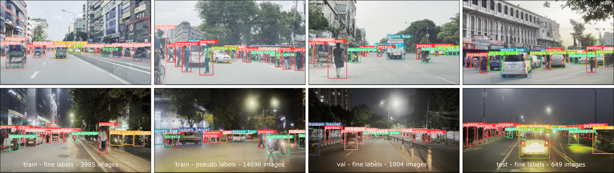

## RSUD20K

**Concordia University**

Hasib Zunair, Shakib Khan, A. Ben Hamza

[[`Paper`](https://arxiv.org/abs/2401.07322)] [[`Project`](link)] [[`Demo`](#4-demo)] [[`BibTeX`](#5-citation)]

This is official code for our **paper under review at ICIP 2024**:<br>
[RSUD20K: A Dataset for Road Scene Understanding In Autonomous Driving](https://arxiv.org/abs/2401.07322)
<br>
 


RSUD20K is a new object detection dataset for road scene understanding, comprised of over **20K** high-resolution images from the driving perspective on Bangladesh roads, and includes **130K** bounding box annotations for **13** objects.

[](https://youtu.be/d7gfy9iqOlDVTe3o)

## 1. Specification of dependencies

This code requires Python 3.8 and CUDA 11.4. Create and activate the following conda envrionment.

```bash
git clone https://github.com/hasibzunair/RSUD20K
cd RSUD20K
# Create fresh env
conda create -n rsud python=3.8
pip install moviepy
pip install opencv-python
pip install -r yolov6_src/requirements.txt # for YOLOv6
# Export
conda env export > environment.yml

# OR create from environment.yml
conda update conda
conda env create -f environment.yml
conda activate rsud
```

## 2. Dataset

RSUD20K dataset is available to download at this [link](https://www.kaggle.com/datasets/hasibzunair/rsud20k-bangladesh-road-scene-understanding). Open a new folder named `datasets` and keep it there. RSUD20K consists of the following classes for multi-class object detection:

```bash
# classes.txt
person
rickshaw
rickshaw van
auto rickshaw
truck
pickup truck
private car
motorcycle
bicycle
bus
micro bus
covered van
human hauler
```

For details on format, see [here](https://github.com/meituan/YOLOv6/blob/main/docs/Train_custom_data.md#1-prepare-your-own-dataset).

**Dataset statistics**:

| Name  | Number of images/label pairs |
| ------------- | ------------- |
| `train`  | 3985 |
| `val`  | 1004 |
| `test`  | 649 |
| `pseudo` (used for training)  | 14696 |

Filenames of different splits types can be found in [split-names.csv](./csv/split-names.csv).

## 3. Training and Evaluation

To train a YOLOv6 model, first download the pretrained model (S and L operating at 320*320) from [here](https://github.com/meituan/YOLOv6/releases/tag/0.4.0) and put them in `yolov6_src/weights` folder. Then run:

```bash
cd yolov6_src
# S
python tools/train.py --batch 12 --conf configs/yolov6s_finetune.py --data data/rsud20k.yaml --device 0
# M
python tools/train.py --batch 12 --conf configs/yolov6m_finetune.py --data data/rsud20k.yaml --device 0
# L
python tools/train.py --batch 12 --conf configs/yolov6l_finetune.py --data data/rsud20k.yaml --device 0
# M6
python tools/train.py --batch 6 --conf configs/yolov6m6_finetune.py --data data/rsud20k.yaml --device 0
```

Evaluate model on validation or test set. Model checkpoints are saved in `yolov6_src/runs` folder.

```bash
# validation set
python tools/eval.py --data data/rsud20k.yaml  --weights runs/train/exp/weights/best_ckpt.pt --task val --device 0
# test set
python tools/eval.py --data data/rsud20k.yaml  --weights runs/train/exp/weights/best_ckpt.pt --task test --save_dir runs/test/ --device 0
# or
source run_eval.sh
```

Make predictions on set of images or videos.

```bash
# infer on images
python tools/infer.py --weights runs/train/exp/weights/best_ckpt.pt --yaml data/rsud20k.yaml --source ../datasets/rsud20k/images/test  --device 0
# infer on videos
python tools/infer.py --weights runs/train/exp/weights/best_ckpt.pt --yaml data/rsud20k.yaml --source ../datasets/resized_videos/ --device 0
# infer on images and save .txt files for pseudo labels
python tools/infer.py --weights runs/pseudo/YOLOv6-M6/train/exp/weights/best_ckpt.pt --yaml data/rsud20k.yaml --source ../datasets/train_unlbl/  --device 0 --save-txt
```

We also provide training and evaluation code for state-of-the-art object detectors such as YOLOv8, DETR and RTMDET [here](./object_detectors/).

## 4. Pre-trained models

We provide pretrained models on [GitHub Releases](https://github.com/hasibzunair/RSUD20K/releases/tag/v1) for reproducibility.

|Model      | Params(M)  |   mAP(%)  |   Download   |
|------------------|------------------|---------|-------------|
| YOLOv6-S           | 18.5          | 72.0   | [download](https://github.com/hasibzunair/RSUD20K/releases/download/v1/yolov6s.pt) |
| YOLOv6-M           | 34.9          | 73.5   | [download](https://github.com/hasibzunair/RSUD20K/releases/download/v1/yolov6m.pt) |
| YOLOv6-L           | 59.6          | 73.7   | [download](https://github.com/hasibzunair/RSUD20K/releases/download/v1/yolov8l.pt) |
| YOLOv6-M6           | 79.6          | 77.9   | [download](https://github.com/hasibzunair/RSUD20K/releases/download/v1/yolov6m6.pt) |
| YOLOv8-S        | 11.2 | 69.4   | [download](https://github.com/hasibzunair/RSUD20K/releases/download/v1/yolov8s.pt) |
| YOLOv8-M | 25.9  | 71.8  | [download](https://github.com/hasibzunair/RSUD20K/releases/download/v1/yolov8m.pt) |
| YOLOv8-L           | 43.7          | 70.4   | [download](https://github.com/hasibzunair/RSUD20K/releases/download/v1/yolov8l.pt) |
| RTMDeT           | 4.8          | 65.4   | [download](https://github.com/hasibzunair/RSUD20K/releases/download/v1/rtmdet.pth) |
| DETR           | 41.3          | 49.9   | [download](https://github.com/hasibzunair/RSUD20K/releases/download/v1/detr.pth) |

## 5. Demo

TBA.

## 6. Citation

TBA.

## Project Notes

<details><summary>Click to view</summary>
<br>

**[Feb 9, 2024]** `bdss` named changed to `rsud20k`. Dataset details:

videos: has sub folders of different places/conditions which itself has clips of different streets.

v1: train/val/test has 54//19/11 videos group partitioned in street level from `videos`.

v2: train/val/test has frames from `v1`. 18762, 1008, 656 images.

v3: 3,985 training images and labels, 14,762 unlabeled images. Some images dropped as no target objects.

v4: 3,985 training images and labels, 126 validation images and labels from the train set itself.

`bdss5k` : train, val and test sets have 3,985, 1,004 and 649 image/label pairs respectively. `train` split was used to train YOLOv6-M6 model for pseudo labeleing. `val` and `test` splits were created by semi-automatic labeleing.

**[Nov 16, 2023]** Created BDSS20K! 18681 train (3985 labeled + 14696 pseudo), 1004 val and 649 test pairs. Total 20,334 pairs.

**[Nov 14, 2023]** Infer on train_unlbl 14,762 images using using YOLOv6-M6 (full-auto). 14696 images after cleaning.

**[Oct 18, 2023]** Created bdss5k which has 3,985, 1,004 and 649 train, val and test image/label pairs respectively.

**[Oct 12, 2023]** Label descriptions are generated by using ChatGPT. Input prompt is: "describe what a {class name} looks like in 15-20 words". Below are descriptions.

- "A person is a living being with a complex physical form, including a head, torso, limbs, and varied appearance based on ethnicity and individual traits.": "person"
- "A rickshaw is a human-powered or motorized vehicle with a simple frame, seating, and often two or three wheels." : "rickshaw"
- "A rickshaw van is a motorized three-wheeled vehicle with an enclosed cabin for passengers or goods, and typically a driver upfront.": "rickshaw van"
- "An auto rickshaw is a compact, three-wheeled motorized vehicle with a cabin for passengers, a driver upfront, and a rear engine.": "auto rickshaw"
- "A truck is a large, motorized vehicle with a driver's cabin, cargo area, wheels, and often a distinct front grille.": "truck"
- "A pickup truck is a smaller motorized vehicle with a driver's cabin and an open cargo bed in the rear.": "pickup truck"
- "A private car is a four-wheeled motor vehicle designed for personal transportation, typically with seating for passengers and an enclosed cabin.": "private car"
- "A motorcycle is a two-wheeled motor vehicle with a seat for a rider and often a pillion seat for a passenger.": "motorcycle"
- "A bicycle is a human-powered vehicle with two wheels, pedals, a frame, handlebars, and a seat for a rider.": "bicycle"
- "A bus is a large motorized vehicle with a passenger cabin, typically featuring multiple seats, windows, and a distinctive elongated shape.": "bus"
- "A micro bus is a smaller motorized vehicle, similar to a standard bus but more compact with seating for fewer passengers.": "micro bus"
- "A covered van is a motorized vehicle with a closed cargo area, often used for transporting goods, and may have a driver's cabin upfront.": "covered van"
- "A human hauler is a motorized vehicle designed for transporting passengers, similar to an auto rickshaw or tuk-tuk, with a cabin and driver upfront.": "human hauler"

The descriptions will be used as input prompts to the foundation models. Idea for prompting LLMs to get descriptions is inspired by https://arxiv.org/abs/2309.06809.

**[Oct 5, 2023]** Relabel data: python3 labelImg.py ../../datasets/bdss_v4/test/images/ ../../datasets/bdss_v4/test/labels/classes.txt

**[Sept 28, 2023]** For semi-automatic stage, val and test set images are inferred using YOLOv6 M6.

**[Sept 22, 2023]** 3,985 training images and labels, 14,762 unlabeled images.  1008 val, and 656 test. Total of 20,441 images. To train a YOLOv6 model, clone YOLOv6 source code from this commit: https://github.com/meituan/YOLOv6/tree/4364f29bf3244f2e73d0c42a103cd7a9cbb16ca9.

**[Sept 14, 2023]** As there are typically no lanes and roads are thin, viewpoints are a problem for an object (i.e. front and back side of object in train14861.jpg, train17305.jpg same object but front back viewpoints, also small, so very hard cases) as it is coming and going in the road so need to recognize both viewpoints correctly. This is not usual in other scene datasets. Also, most vehicles are human ridden (rickshaw, rickshaw van, motorcycle, bicycle) so difficult to recognize with person on it. Truck, pickup truck covered van similar, require fine grained understanding, especially when objects are far or close since big or small sizes. Scene challenges: night time, rainy, glare from sun, blurry images. What else?

**[Aug 4, 2023]** Initial data labeling stats (1hr 74 images).

LabelImg tool on macos:

```bash
git clone https://github.com/HumanSignal/labelImg
cd labelImg
pip3 install pyqt5 lxml
make qt5py3
python3 labelImg.py ../../datasets/bdss_v3/chunk2/ ../../datasets/bdss_v3/chunk2_labels/classes.txt
```

**[Aug 3, 2023]** Train images split into labeled (4000) and unlabeled (14,762) sets.

Total images are 23,246 which has 18,762 train, 1008 val, and 656 test.

Labeleing criteria:

* `person` : draw boxes on persons only that are walking, not on vehicles.
* `rickshaw` : boxes without person if possible. should be a tight box around the object. 
* `rickshaw van` : boxes around any three wheeler vans pulled by humans (e.g. selling vegetables or fruits).
* `auto rickshaw` : any CNG, three wheeler electric veheicles
* `truck`: big or small trucks
* `pickup truck` : blue small vans, other small vans.
* `private car` : any private car (includes jeeps too).
* `motorcycle` : box should not have person if possible.
* `bicycle` : box should not have person if possible.
* `bus`: any bus, small or big (e.g ena bus).
* `micro bus`: big cars like ambulance or other 7/8 seater cars (also Noah).
* `covered van`: like pickup, but covered.
* `human hauler`: leguna!

In general, all boxes should be tight as possible. If the object is occluded more than 50%, don't label. If more than 50% is visible, only then draw tight box around it. In case of very dense scenes, a bit of overlapping boxes are fine.

**[Aug 3, 2023]** List of classes:

```bash
# classes.txt
person
rickshaw
rickshaw van
auto rickshaw
truck
pickup truck
private car
motorcycle
bicycle
bus
micro bus
covered van
human hauler
```

**[July 19, 2023]** Inspect data with labeImg
```
labelImg [IMAGE_PATH] [PRE-DEFINED CLASS FILE]
```

**[July 14, 2023]** Get frames from videos. For val and test, frame sampling rate is 60,60 and for train it is 400.

```
python utils/videos_to_frames.py --source ./datasets/bdss_v1/test --dest ./datasets/bdss_v2/test --maxframes 60
python utils/videos_to_frames.py --source ./datasets/bdss_v1/val --dest ./datasets/bdss_v2/val --maxframes 60
python utils/videos_to_frames.py --source ./datasets/bdss_v1/train --dest ./datasets/bdss_v2/train --maxframes 400
```

**[July 6, 2023]** Started project!

The videos were in format:

```videos/
        mawa/
            *.MOV
            ...
        dhanmondi/
            *.MOV
            ...
        night/
            *.MOV
            ...
        rainydays/
            *.MOV
            ...
```

Where each folder has video clips of different streets of the same area. Video resolution is 1920 × 1080.

From here, we make train val and test sets for the videos by the following rule. For each folder/place/condition, we roughly take 70:20:10 for train val and test sets.
</details>

## Acknowledgements

This codebase is built on top of [YOLOv6](https://github.com/meituan/YOLOv6), [Ultralytics](https://github.com/ultralytics/ultralytics), [MMDetection](https://github.com/open-mmlab/mmdetection) and [MMYolo](https://github.com/open-mmlab/mmyolo).
